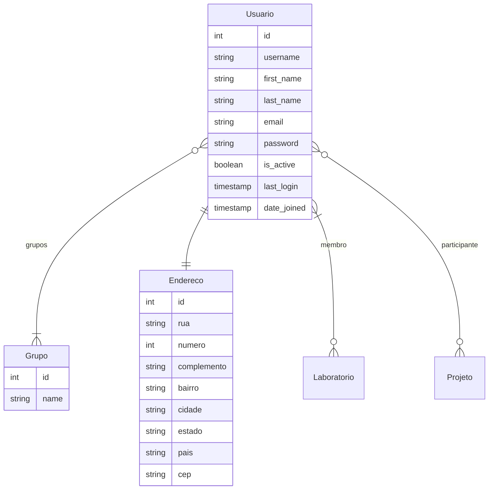

# Contagem de Pontos de Função

A contagem em **Pontos de Função (PF)** permite a determinação do **Tamanho Funcional** do projeto de software.
A análise de ponto de função (APF) é um processo para a identificação e contagem das funcionalidades baseadas nos conceitos 
de **Funções de Dados** e **Funções de Transação**. 

Os conceitos relacionados com dados são os **Arquivos de Lógica Interna (ALI)** e os **Arquivos de Interface Externa (AIE)**, 
e os conceitos relacionados com operações externas a fronteira do sistema são: 
**Entrada Externa (EE)**, **Consulta Externa (CE)** e **Saída Externa (SE)**.

Existem várias práticas de contagem, cada uma com suas especificidades.

## Contagem Indicativa

Na contagem indicativa (Ci) só é necessário conhecer e analisar as **Funções de Dados**. Desta forma, 
os **ALI**s (Arquivos Lógicos Internos) com o valor de *35 PF* cada e os **AIE**s (Arquivos de Interface Externa) com o valor de *15 PF* cada.

### Modelo de Dados 

### Contagem Indicativa

| Função de Dado  | Entidades Relacionadas | Tamanho em PF |
| --------------- | ---------------------- | :-----------: |
| ALI Usuário     | Usuario e Grupo        | 35 PF         |
| ALI Projeto     | Projeto                | 35 PF         |
| ALI Laboratorio | Laboratorio            | 35 PF         |
| AIE Endereço    | Endereço               | 15 PF         |
| **Total**       | **Ci**                 | **120 PF**    |

### Contagem Detalhada (Cd)

|     Descrição      |   Tipo   |   RLR   |   DER   |   Complexidade   |   Tamanho em PF   |
| ------------------ | -------- | ------- | ------- | ---------------- | :---------------: |
|  ALI Usuário       |   ALI    |    2    |    11   |       Baixa      | 7 PF              |
|  ALI Projeto       |   ALI    |         |         |                  |  PF               |
|  ALI Laboratorio   |   ALI    |         |         |                  |  PF               |
|  AIE Endereço      |   AIE    |         |         |                  |  PF               |
|  **Descrição**     | **Tipo** | **ALR** | **DER** | **Complexidade** | **Tamanho em PF** |
|  Inserir Grupo     |    EE    |    1    |    2    |      Baixa       | 3 PF              |
|  Atualizar Grupo   |    EE    |    1    |    2    |      Baixa       | 3 PF              |
|  Consultar Grupo   |    CE    |    1    |    2    |      Baixa       | 3 PF              |
|  Inserir Usuário   |    EE    |    2    |    9    |      Média       | 4 PF              |
|  Atualizar Usuário |    EE    |    2    |    9    |      Média       | 4 PF              |
|  Consultar Usuário |    CE    |    2    |    9    |      Média       | 4 PF              |
|  Detalhar Usuário  |    CE    |    2    |    9    |      Média       | 4 PF              |
|   **Total**        |          |         |         |     **Cd**       | **xx PF**         |

