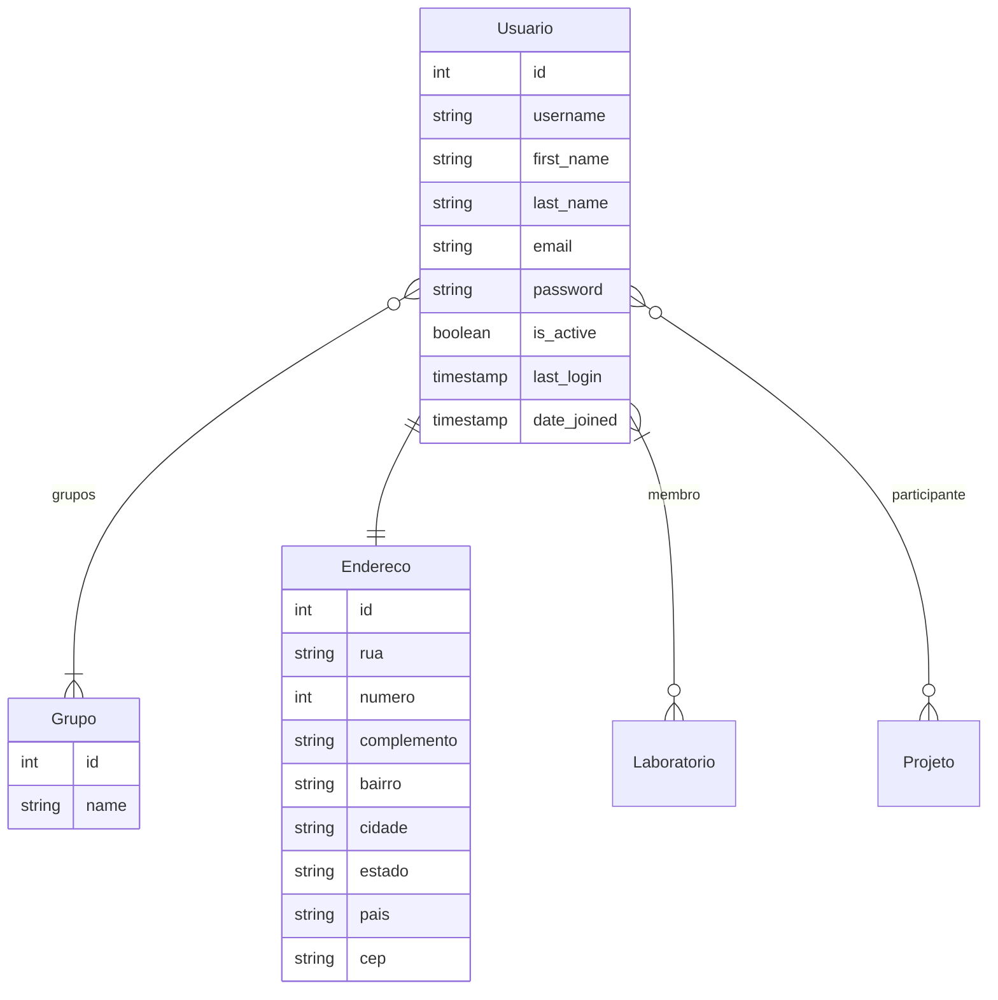

# Contagem de Pontos de Função

A contagem em **Pontos de Função (PF)** permite a determinação do **Tamanho Funcional** do projeto de software.
A análise de ponto de função (APF) é um processo para a identificação e contagem das funcionalidades baseadas nos conceitos 
de **Funções de Dados** e **Funções de Transação**. 

Os conceitos relacionados com dados são os **Arquivos de Lógica Interna (ALI)** e os **Arquivos de Interface Externa (AIE)**, 
e os conceitos relacionados com operações externas a fronteira do sistema são: 
**Entrada Externa (EE)**, **Consulta Externa (CE)** e **Saída Externa (SE)**.

Existem várias práticas de contagem, cada uma com suas especificidades.

## Contagem Indicativa

Na contagem indicativa (Ci) só é necessário conhecer e analisar as **Funções de Dados**. Desta forma, 
os **ALI**s (Arquivos Lógicos Internos) com o valor de *35 PF* cada e os **AIE**s (Arquivos de Interface Externa) com o valor de *15 PF* cada.

### Modelo de Dados 

```mermaid
erDiagram
    Grupo {
        int id
        string name
    }
    Usuario {
        int id
        string username
        string first_name
        string last_name
        string email
        string password
        boolean is_active
        timestamp last_login
        timestamp date_joined
    }
    Endereco {
        int id
        string rua
        int numero
        string complemento
        string bairro
        string cidade
        string estado
        string pais
        string cep
    }
    Usuario }o--|{ Grupo : grupos
    Usuario ||--|| Endereco : ""
    Usuario }|--o{ Laboratorio : membro
    Usuario }o--o{ Projeto : participante
```

### Contagem Indicativa

| Função de Dado  | Entidades Relacionadas | Tamanho em PF |
| --------------- | ---------------------- | :-----------: |
| ALI Usuário     | Usuario e Grupo        | 35 PF         |
| ALI Projeto     | Projeto                | 35 PF         |
| ALI Laboratorio | Laboratorio            | 35 PF         |
| AIE Endereço    | Endereço               | 15 PF         |
| **Total**       | **Ci**                 | **120 PF**    |

### Contagem Detalhada (Cd)

|     Descrição      |   Tipo   |   RLR   |   DER   |   Complexidade   |   Tamanho em PF   |
| ------------------ | -------- | ------- | ------- | ---------------- | :---------------: |
|  ALI Usuário       |   ALI    |    2    |    11   |       Baixa      | 7 PF              |
|  ALI Projeto       |   ALI    |         |         |                  |  PF               |
|  ALI Laboratorio   |   ALI    |         |         |                  |  PF               |
|  AIE Endereço      |   AIE    |         |         |                  |  PF               |
|  **Descrição**     | **Tipo** | **ALR** | **DER** | **Complexidade** | **Tamanho em PF** |
|  Inserir Grupo     |    EE    |    1    |    2    |      Baixa       | 3 PF              |
|  Atualizar Grupo   |    EE    |    1    |    2    |      Baixa       | 3 PF              |
|  Consultar Grupo   |    CE    |    1    |    2    |      Baixa       | 3 PF              |
|  Inserir Usuário   |    EE    |    2    |    9    |      Média       | 4 PF              |
|  Atualizar Usuário |    EE    |    2    |    9    |      Média       | 4 PF              |
|  Consultar Usuário |    CE    |    2    |    9    |      Média       | 4 PF              |
|  Detalhar Usuário  |    CE    |    2    |    9    |      Média       | 4 PF              |
|   **Total**        |          |         |         |     **Cd**       | **xx PF**         |

# Exemplo 2

## Contagem Indicativa (Ci)

Na contagem indicativa só é necessário analisar os **ALIs** (Arquivos Lógicos Internos) com o valor de **35 PF** cada 
e os **AIEs** (Arquivos de Interface Externa) com o valor de **15 PF** cada.

| ALI/AIE          | Entidades Relacionadas    |  PF  |
|------------------|---------------------------|------|
| AIE Language     | Language                  |  15  |
| AIE Genre        | Genre                     |  15  |
| ALI User         | User e Group              |  35  |
| ALI Library      | Library                   |  35  |
| ALI Author       | Author                    |  35  |
| ALI Book         | Book                      |  35  |
| ALI BookInstance | BookInstance e LoanStatus |  35  |

Tamanho Funcional **Ci = 205 PF** ( 133,25 PF < Ci <= 276,75 PF)

### Duração e custo considerando produtividade 8h/PF e Ci = 205 PF

A produtividade de python é 8h/PF (alta produtividade segundo a SERPRO).
Com Duração de 1640 horas, um dev trabalhando 8h por dia temos 205 dias de duração.
Custo de R$ 17,00 por hora, então totalizamos R$ 27880,00.

### Duração e custo considerando produtividade 1h/PF e Ci = 133 PF

A produtividade de python com 1h/PF.
Com Duração de 133 horas, um dev trabalhando 8h por dia temos 17 dias de duração.
Custo de R$ 17,00 por hora, então totalizamos R$ 2261,00.

## Contagem Estimativa (Ce)

Na Ce todas as funções de dados são classificados como baixa complexidade.

| ALI/AIE          | Entidades Relacionadas    |  PF  |
|------------------|---------------------------|------|
| AIE Language     | Language                  |   5  |
| AIE Genre        | Genre                     |   5  |
| ALI User         | User e Group              |   7  |
| ALI Library      | Library                   |   7  |
| ALI Author       | Author                    |   7  |
| ALI Book         | Book                      |   7  |
| ALI BookInstance | BookInstance e LoanStatus |   7  |
|                  | **Total de Dados**        |**45**|

Na Ce todas as operações elementares são classificadas como de média complexidade: 
**EE** tem 4 PF, **CE** tem 4 PF e **SE** tem 5 PF. 

| Operação                | Tipo | Complexidade    |  PF  |
|-------------------------|------|-----------------|------|
| Insert User             |  EE  |      Média      |   4  |
| Update User             |  EE  |      Média      |   4  |
| List User               |  CE  |      Média      |   4  |
| Delete User             |  EE  |      Média      |   4  |
| Block User              |  EE  |      Média      |   4  |
| List Loans User         |  SE  |      Média      |   5  |
| Insert Author           |  EE  |      Média      |   4  |
| Update Author           |  EE  |      Média      |   4  |
| List Author             |  CE  |      Média      |   4  |
| Delete Author           |  EE  |      Média      |   4  |
| Insert Genre            |  EE  |      Média      |   4  |
| List Genre              |  CE  |      Média      |   4  |
| Insert Language         |  EE  |      Média      |   4  |
| List Language           |  CE  |      Média      |   4  |
| Insert Library          |  EE  |      Média      |   4  |
| Update Library          |  EE  |      Média      |   4  |
| List Library            |  CE  |      Média      |   4  |
| Delete Library          |  EE  |      Média      |   4  |
| List Books Library      |  SE  |      Média      |   5  |
| List Loans Library      |  SE  |      Média      |   5  |
| Insert Book             |  EE  |      Média      |   4  |
| Update Book             |  EE  |      Média      |   4  |
| List Book               |  CE  |      Média      |   4  |
| Delete Book             |  EE  |      Média      |   4  |
| Insert BookInstance     |  EE  |      Média      |   4  |
| Update BookInstance     |  EE  |      Média      |   4  |
| List BookInstance       |  CE  |      Média      |   4  |
| Delete BookInstance     |  EE  |      Média      |   4  |
| RequestLoan BookInstance|  EE  |      Média      |   4  |
| AcceptLoan BookInstance |  EE  |      Média      |   4  |
| MakeReturn BookInstance |  EE  |      Média      |   4  |
|                         |      |**Total de Dados**|**127**|

Tamanho Funcional: Dados + Operações

**Ce** = 45 PF + 127 PF = **172 PF**

## Contagem Detalhada
