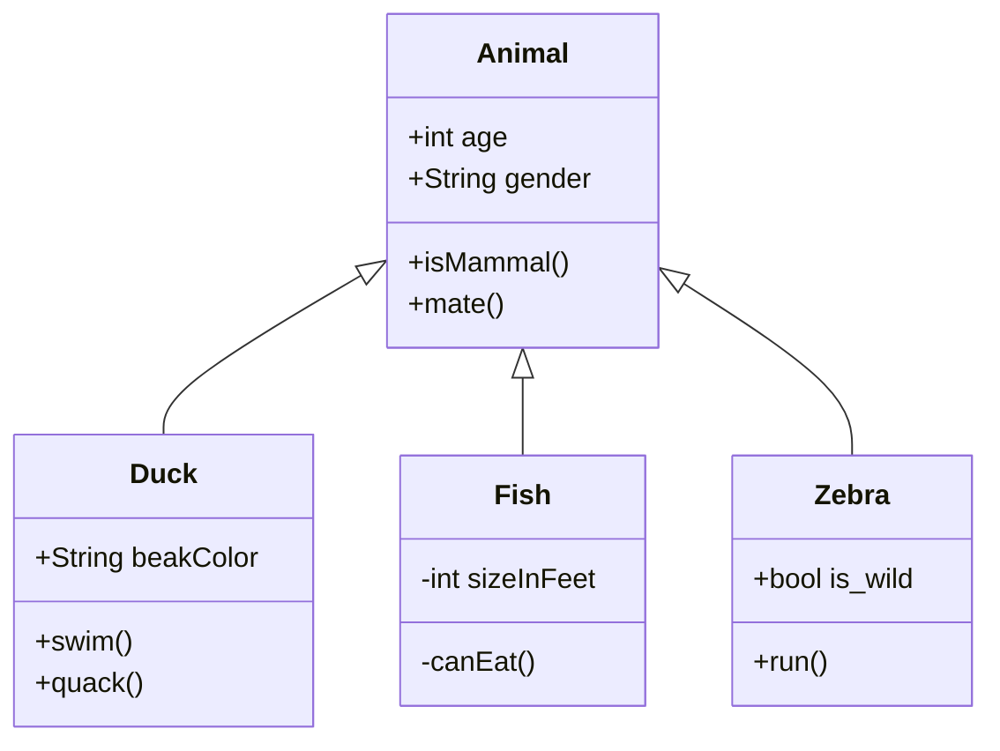
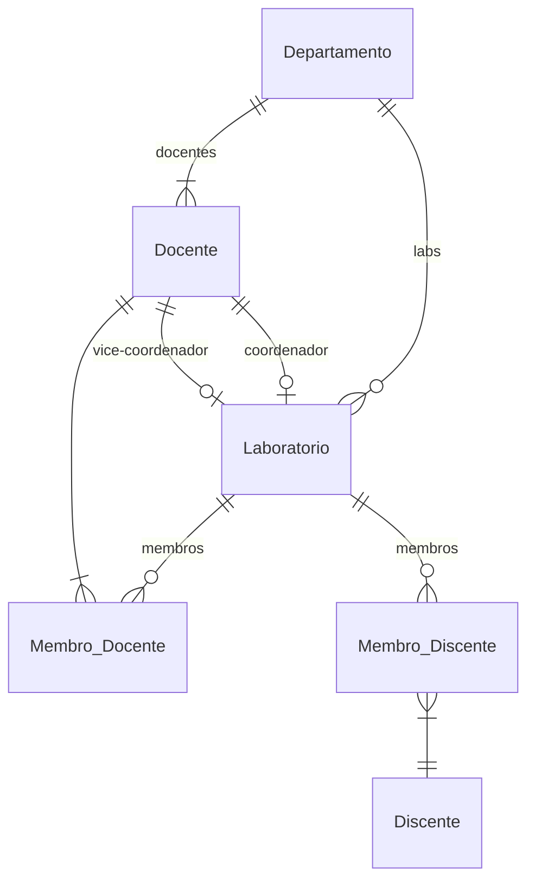

# Documento de Modelos

Neste documento temos o modelo Conceitual (UML) ou de Dados (Entidade-Relacionamento). Temos também a descrição das entidades e o dicionário de dados.

Para a modelagem pode se usar o Astah UML ou o BrModelo. Uma ferramenta interessante para modelos UML é a [YUML](http://yuml.me), no link temos um exemplo de [Modelo UML com YUML](yuml/monitoria-yuml.md). Atualmente é possível usar a ferramenta **Mermaid** segundo o blog do GitHub [Include diagrams in your Markdown files with Mermaid](https://github.blog/2022-02-14-include-diagrams-markdown-files-mermaid/). A documentação do **Mermaid** pode ser encontrada em [Mermaid in GitHub](https://mermaid-js.github.io/mermaid).

## Modelo Conceitual

### Diagrama de Classes usando Mermaid

### Descrição das Entidades

Descrição sucinta das entidades presentes no sistema.

| Entidade | Descrição   |
|----------|------------------------------------------------------------------------------------------------------------------------------------------------------|
| Animal   | Entidade abstrata para representar informações gerais dos Animais: age, gender, isMammal(), mate().                                                  |
| Duck     | Entidade que representa um Pato tem as informações: String beakColor, +swim(), +quack(). A classe Duck estende a classe abstrata Animal. |
| Fish     | Entidade que representa um Peixe tem as informações: sizeInFeet, -canEat(). A classe Peixe estende a classe abstrata Animal.                                                                   |
| Zebra    | Entidade que representa um Zebra tem as informações is_wild, run(). A classe Zebra estende a classe abstrata Animal.                                                                   |

## Modelo de Dados (Entidade-Relacionamento)

Para criar modelos ER é possível usar o BrModelo e gerar uma imagem. Contudo, atualmente é possível criar modelos ER usando a ferramenta **Mermaid**, escrevendo o modelo diretamente em markdown. Acesse a documentação para escrever modelos [ER Diagram Mermaid](https://mermaid-js.github.io/mermaid/#/entityRelationshipDiagram).

### Dicionário de Dados

|   Tabela   | Laboratório |
| ---------- | ----------- |
| Descrição  | Armazena as informações de um laboratório acadêmico. |
| Observação | Laboratórios acadêmicos podem ser de Ensino, Pesquisa, Extensão, P&D, etc. |

|  Nome         | Descrição                        | Tipo de Dado | Tamanho | Restrições de Domínio |
| ------------- | -------------------------------- | ------------ | ------- | --------------------- |
| codigo        | identificador gerado pelo SGBD   | SERIAL       | ---     | PK / Identity |
| sigla         | representação em sigla do lab    | VARCHAR      | 15      | Unique / Not Null |
| nome          | nome do laboratório              | VARCHAR      | 150     | Not Null |
| descricao     | detalhes sobre o laboratório     | VARCHAR      | 250     | --- |
| endereco      | endereço e localização do lab    | VARCHAR      | 150     | --- |
| data_criacao  | data de criação do lab           | DATE         | ---     | Not Null |
| portaria      | portaria de criação do lab       | VARCHAR      | 50      | --- |
| link_portaria | URL para a portaria (PDF)        | VARCHAR      | 150     | --- |
| site          | URL para o site do laboratório   | VARCHAR      | 150     | --- |
| e-mail        | e-mail de contato do laboratório | VARCHAR      | 150     | --- |
| departamento  | departamento vinculado ao lab    | SERIAL       | ---     | FK / Not Null |
