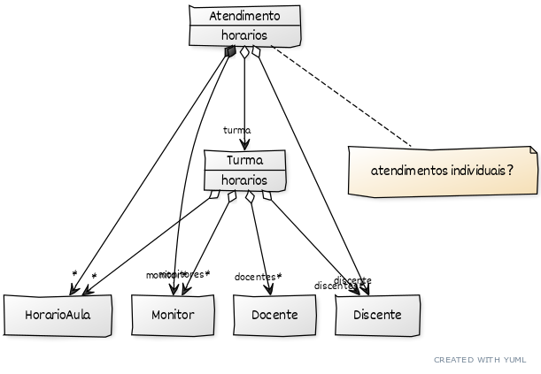

# Documento de Visão

Documento construído a partido do **Modelo BSI - Doc 001 - Documento de Visão** que pode ser encontrado no
link: https://docs.google.com/document/d/1DPBcyGHgflmz5RDsZQ2X8KVBPoEF5PdAz9BBNFyLa6A/edit?usp=sharing

## Descrição do Projeto

Descrever de forma geral o projeto.

## Equipe e Definição de Papéis

Membro     |     Papel   |   E-mail   |
---------  | ----------- | ---------- |
Taciano    | Cliente Professor  | taciano@bsi.ufrn.br
Sandra     | Cliente (Diretora) | sandra@ceres.ufrn.br
Zé         | Analista, Testador | ze@silva.com
Maria      | Gerente, Desenvolvedor | maria@silva.com

### Matriz de Competências

Membro     |     Competências   |
---------  | ----------- |
Taciano    | Desenvolvedor Java, Junit, Eclipse, JSP, JSF, Hibernate, Matemática, Latex, etc |
Sandra     | Gestão, Geográfa |
Zé         | Desenvolvedor Java, Astrofísico |
Maria      | Gestão, Desenvolvedor Java, Pesquisadora em Engenharia de Software |

## Perfis dos Usuários

O sistema poderá ser utilizado por diversos usuários. Temos os seguintes perfis/atores:

Perfil                                 | Descrição   |
---------                              | ----------- |
Administrador | Este usuário realiza os cadastros base e pode realizar qualquer função.
Docentes | Este usuário pode verificar seu horário, e acessar turmas, estruturas curriculares, lista de alunos nas turmas, cadastrar enquetes e ver resultados, etc
Discente | Este usuário pode verificar o plano de aulas (horários), demosntrar interesse em uma turma, e acessar turmas, a estrutura do curso, responder enquetes, etc.

## Lista de Requisitos Funcionais

Requisito                                 | Descrição   | Ator |
---------                                 | ----------- | ---------- |
RF001 - Manter um cadastro de Centros     | Um centro representa uma unidade administrativa da Universidade. Um centro tem código, nome, sigla, endereço e site. | Administrador |
RF002 - Manter um cadastro de Departamentos | Um departamento tem código, nome, sigla, endereço e o centro a qual pertence. | Administrador |
RF003 - Manter o cadastro de Salas | Uma sala tem um número, um nome, capacidade, tamanho, bloco e o centro a qual pertence. | Administrador |
RF004 - Manter cadastro de Componentes Curriculares | Um componente curricular é de um tipo de componente. Um componente curricular tem: código, nome, ementa, departamento, carga horária e modalidade, equivalências e requisitos com outros componentes, data de criação. | Administrador |
RF005 - Manter o cadastro de Horários de Aula | Um horário tem: um dia de semana, um turno, uma ordem (ordenação/identificador), uma hora de início, uma hora de final | Administrador |
RF006 - Manter o cadastro de professores | um professor tem: matrícula, nome, e-mail, telefone e o departamento | Administrador |
RF007 - Manter cadastro de Turmas | Uma turma tem: código, professor, sala e horários (horário da turma). Uma turma é de um componente curricular. Uma turma tem um ou mais professores. Uma turma tem uma ou mais salas. Uma turma tem vários horários de aulas. | Chefes e Coordenadores |

### Modelo Conceitual

Abaixo apresentamos o modelo conceitual usando o **YUML**.

 

O código que gera o diagrama está [Aqui!](yuml/monitoria-yuml.md). O detalhamento dos modelos conceitual e de dados do projeto estão no [Documento de Modelos](doc-modelos.md).

#### Descrição das Entidades

## Lista de Requisitos Não-Funcionais

Requisito                                 | Descrição   |
---------                                 | ----------- |
RNF001 - Deve ser acessível via navegador | Deve abrir perfeitamento no Firefox e no Chrome. |
RNF002 - Consultas deve ser eficiente | O sistema deve executar as consultas em milessegundos |
RNF003 - Log e histórico de acesso e funções | Deve manter um log de todos os acessos e das funções executadas pelo usuário |

## Riscos

Tabela com o mapeamento dos riscos do projeto, as possíveis soluções e os responsáveis.

Data | Risco | Prioridade | Responsável | Status | Providência/Solução |
------ | ------ | ------ | ------ | ------ | ------ |
10/03/2018 | Não aprendizado das ferramentas utilizadas pelos componentes do grupo | Alta | Todos | Vigente | Reforçar estudos sobre as ferramentas e aulas com a integrante que conhece a ferramenta |
10/03/2018 | Ausência por qualquer motivo do cliente | Média | Gerente | Vigente | Planejar o cronograma tendo em base a agenda do cliente |
10/03/2018 | Divisão de tarefas mal sucedida | Baixa | Gerente | Vigente | Acompanhar de perto o desenvolvimento de cada membro da equipe |
10/03/2018 | Implementação de protótipo com as tecnologias | Alto | Todos | Resolvido | Encontrar tutorial com a maioria da tecnologia e implementar um caso base do sistema |

### Referências
