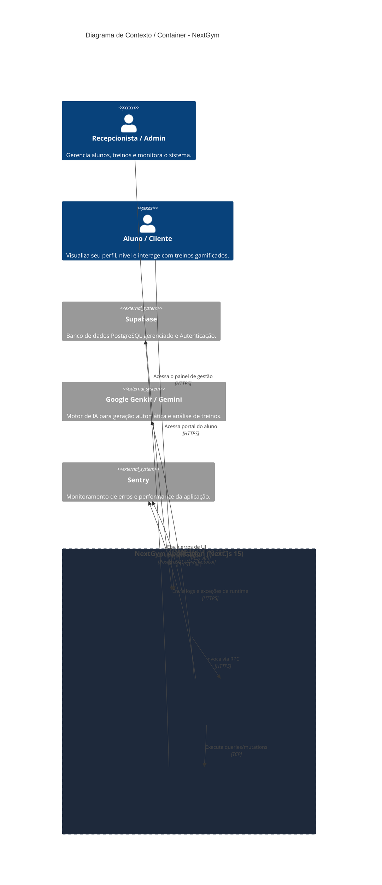
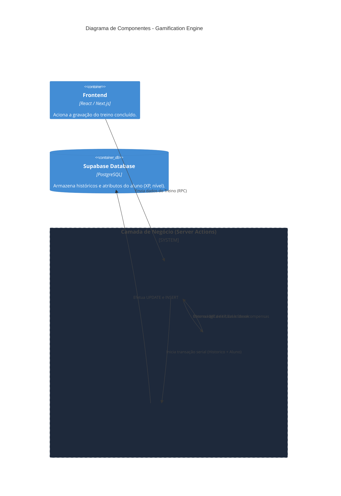

# Arquitetura do Sistema - NextGym

Este documento detalha a arquitetura geral do projeto **NextGym** (PWeb_Project), utilizando os princípios do modelo C4 (níveis de Contexto e Container). A arquitetura é baseada no framework Next.js (App Router), adotando um fluxo full-stack otimizado com Server Actions para comunicação direta entre cliente e banco de dados.

## 1. Diagrama Arquitetural (C4 Model)

## 2. Descrição dos Componentes

A arquitetura do NextGym é monolítica, baseada no conceito *server-first* do Next.js. Os principais componentes são:

### 2.1 NextGym Application (Sistema Central)
- **Frontend (React 19 / App Router):** A camada de apresentação é renderizada primordialmente no servidor (SSR - Server Side Rendering) garantindo SEO e performance. Apenas componentes estritamente interativos são enviados para o cliente. As requisições de estado são cacheadas em múltiplas camadas pelo Next.js.
- **Backend / Server Actions:** Substitui APIs REST tradicionais por chamadas diretas a funções servidoras fortemente tipadas. Todo acesso ao banco de dados e integrações externas ocorre obrigatoriamente nesta camada, garantindo que credenciais não vazem para o cliente.
- **Prisma ORM:** Motor de mapeamento objeto-relacional responsável por traduzir as entidades TypeScript para queries SQL e gerenciar as migrações estruturais do banco de dados.

### 2.2 Sistemas Externos
- **Supabase (PostgreSQL):** Atua como o Banco de Dados relacional central do sistema, sendo consumido exclusivamente pelas *Server Actions* via Prisma.
- **Google Genkit / Gemini AI:** Serviço de inteligência artificial utilizado para orquestrar as automações da plataforma, como geração dinâmica de roteiros de treino baseados no histórico do aluno. Todo o tráfego AI é isolado em `src/ai/`.
- **Sentry:** Infraestrutura de observabilidade. Captura exceções e rastreia gargalos de performance, dividida entre SDKs rodando no navegador do cliente (para captura de erros React) e no servidor Node.js (para capturar falhas de banco e auth).

## 3. Segurança e Padrões (Hard Guards)
Toda comunicação entre o Frontend e as Server Actions valida a sessão do usuário (Auth Guards) na primeira linha de execução antes de invocar o `Prisma` ou `Genkit`, garantindo uma arquitetura robusta contra manipulações indevidas vindas do cliente.

## 4. Zoom in: Gamification Engine (C4 Component)

O sistema de Gamificação opera de forma isolada do frontend, garantindo que o XP e nível do aluno só possam ser alterados pelo próprio sistema mediante a confirmação e validação do registro de um Treino.

