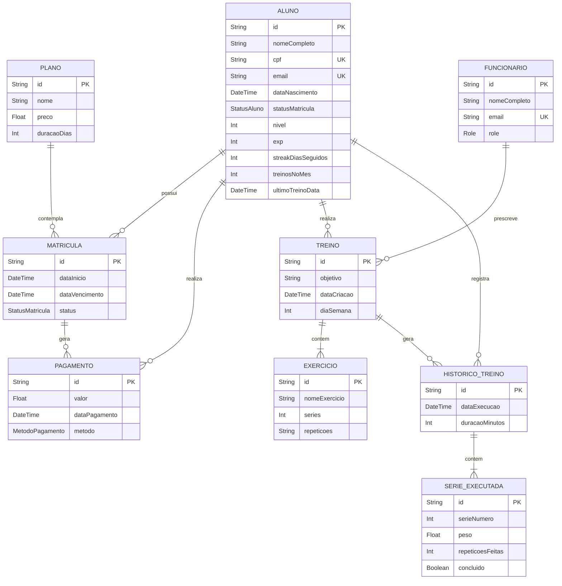

# Modelos do Sistema

## 1. Modelo Conceitual de Dados (MER)

O diagrama abaixo representa a estrutura de Entidade-Relacionamento do banco de dados relacional gerido pelo Prisma no Supabase.

## 2. Gamification Engine (Mecânica de Banco de Dados)

O sistema de Gamificação atualiza os atributos da entidade `ALUNO` (`exp`, `nivel`, `streakDiasSeguidos`, `treinosNoMes`, `ultimoTreinoData`) de forma estritamente vinculada ao registro na entidade `HISTORICO_TREINO`.

- **Transação Atômica:** Quando um `HISTORICO_TREINO` é inserido, a lógica de Gamificação calcula as recompensas. O novo registro de histórico e o update no aluno são executados juntos por meio de uma transação serial (`Serializable`), assegurando que não haja condições de corrida que corrompam os valores de *XP* e *Nível*.
